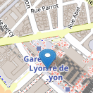

# Leaflet.SmoothMarkerBouncing 

[](http://npm.im/leaflet.smooth_marker_bouncing) 
[](https://github.com/hosuaby/Leaflet.SmoothMarkerBouncing/actions/workflows/ci.yml)
[](https://coveralls.io/github/hosuaby/Leaflet.SmoothMarkerBouncing?branch=master)

<hr />

## Stop the war

This plugin made by Russian and citizen of Russian Federation. 

On 24 February 2022, Russian dictator Vladimir Putin launched an assault on our good neighbor, The Ukraine, starting the bloodiest and most meaningless war in decades. Currently, Ukrainians and Russians are dying for Putin crazy geopolitical illusion.

Open Source is made for everyone. For people of all nationalities and all political beliefs. Sharing is what makes us stronger ! Wherever you are progressive or conservative, pro- or against- NATO, pro- or against- European Union, I hope you are standing for a peace.

Protest, resist and spread the truth! Help, to stop this war. Help to stop Putin.

Assault must end, war must end, Putin must face the trial!

<hr />


Plugin for [Leaflet](http://leafletjs.com/) that will make you markers bounce!

<p align="center">
    
</p>

It provides smooth, lightweight and customizable animation of marker bouncing.
Allows the bouncing of multiple markers on the map, without loss of performance.

### Older browsers

Starting from version `v3.0.0`, plugin is based on CSS3 keyframes to make animation. If you need support older browsers,
it will be better to stick to `v2.0.x`.

## Demo

Check out the [demo](http://hosuaby.github.io/Leaflet.SmoothMarkerBouncing/).

## Usage

Add Javascript file on your page:

```html
<script type="text/javascript"
        src="https://cdn.jsdelivr.net/gh/hosuaby/Leaflet.SmoothMarkerBouncing@v3.0.2/dist/bundle.js"
        crossorigin="anonymous"></script>
```

Or install it as `npm` module:

```shell script
npm install leaflet.smooth_marker_bouncing
```

Plugin provides additional methods to `Marker`:

```javascript
/* Methods of L.Marker class */
L.Marker.setBouncingOptions({..}); // sets options of bouncing of all markers
L.Marker.getBouncingMarkers();     // gets all bouncing markers
L.Marker.stopAllBouncingMarkers(); // asks all markers to stop bouncing

/* Methods of marker instances */
const marker = L.marker([lat, lng]);
marker.setBouncingOptions({..});   // sets options of bouncing for this marker
marker.isBouncing();               // checks if marker is bouncing
marker.bounce();                   // starts the bouncing
marker.bounce(n);                  // makes marker bounce "n" times
marker.stopBouncing();             // stops bouncing of the marker
marker.toggleBouncing();           // starts/stops bouncing of the marker
```

Plugin respects fluent API. All marker instance methods (except `isBouncing`) return the marker object.  
Some usage examples:

```javascript
/* Create a marker and make it bounce immediately */
const marker = L.marker([lat, lng]).addTo(map).bounce();

/* Create a marker and make it bounce 2 times when clicked.
 * Do something when the bouncing is stopped, like open a popup.
 */
const marker = L.marker([lat, lng])
    .addTo(map)
    .on('click', function() {
        this.bounce(2) // bounce 2 times
        .on('bounceend',function() {
            console.log('bounce end');
        }); 
    });

/* Create a marker and set its bouncing options.
 * Bouncing can be started/stopped by the click on the marker.
 */
const marker = L.marker([lat, lng])
    .setBouncingOptions({
        bounceHeight : 60,    // height of the bouncing
        bounceSpeed  : 54,    // bouncing speed coefficient
        exclusive    : true,  // if this marker is bouncing all others must stop
    })
    .addTo(map)
    .on('click', function() {
        this.toggleBouncing();
    });

/* Define options of bouncing for all markers */
L.Marker.setBouncingOptions({
        bounceHeight : 60,   // height of the bouncing
        bounceSpeed  : 54,   // bouncing speed coefficient
});

/* Create 10 markers and each of them will bounce 3 times when clicked */
for (let i = 0; i < 10; i++) {
    const marker = L.marker([lat, lng])
        .addTo(map)
        .on('click', function() {
            this.bounce(3); // bounce 3 times
        });
}
```

## Options of bouncing

You can easily customize bouncing animation supplying options in method `setBouncingOptions`.
This method available on the marker class `L.Marker` and on each of marker instances.  
It's highly recommended define options for all markers via `L.Marker.setBouncingOptions` instead of define them on each 
marker individually.
The animation performance highly increases when all markers have the same options.  
Method `setBouncingOptions` accepts an object with options as parameters.
Animation can be customized with following properties:

- **bounceHeight** - how high marker will bounce (px), *default: 15*
- **contractHeight** - how much marker will contract when it touches the ground (px), *default: 12*
- **bounceSpeed** - bouncing speed coefficient, value used to calculate the speed of bounce animation,
more it becomes high, more animation becomes slow, *default: 52*
- **contractSpeed** - contracting speed coefficient, *default: 52*
- **shadowAngle** - shadow inclination angle, if set to `null` shadow animation disabled (radians), *default:* -𝜋÷4
- **elastic** - activate contract animation when marker touches the ground, *default: true*
- **exclusive** - when it's true, stops the bouncing of other markers when this one starts to bounce.
If another marker start to bounce after, this marker stops. *default: false*

## Events
|Event|Description|
|---|---|
|bounceend|Fired when the animation is done|
